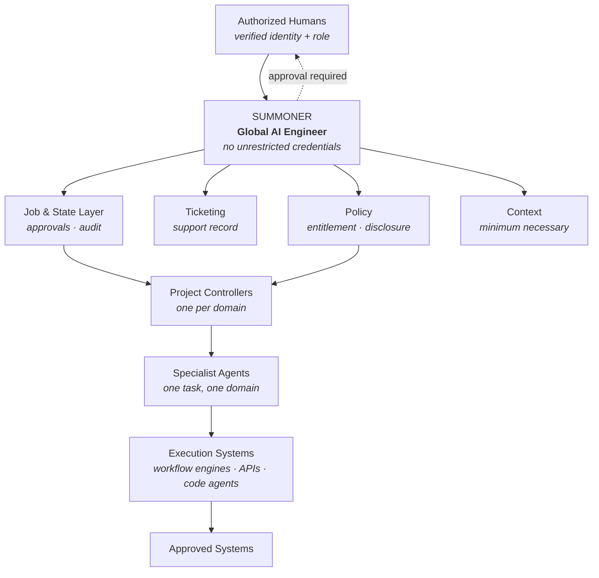
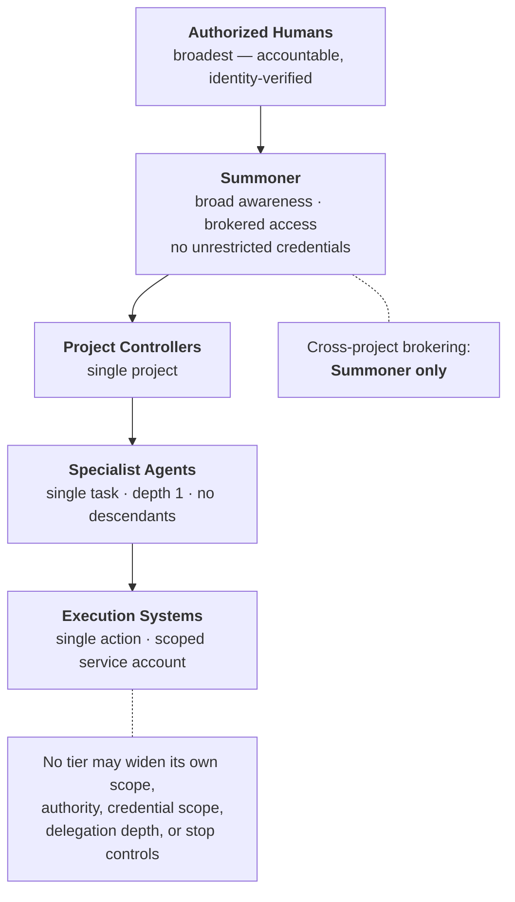
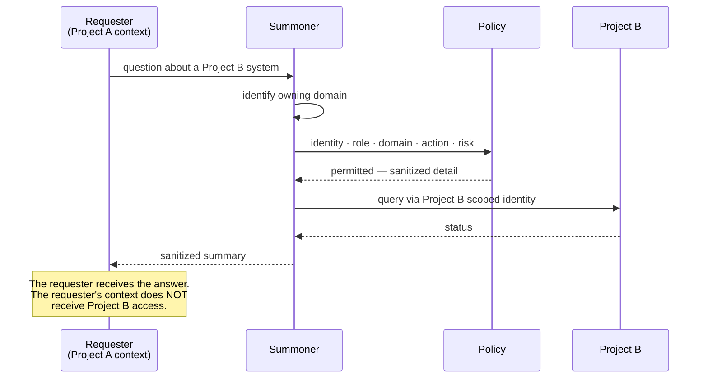
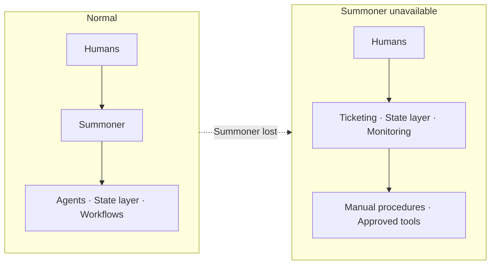
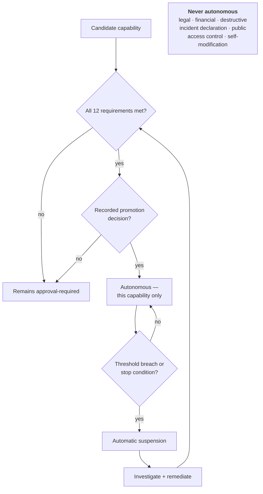

# Summoner Architecture Diagrams

**Status: Documented** — conceptual diagrams. **Nothing shown here is built.**

Last updated: 2026-08-07

---

## 1. Orchestration overview

## 2. Authority narrows at every tier

## 3. Awareness without access

## 4. Continuity — normal vs degraded

**The path does not break — it shortens.** Humans reach the systems of record directly.

## 5. Autonomy promotion

**No capability has entered this flow.**

## What these diagrams omit

Internal component names, credential-store relationships, the ticket-system integration detail,
support-investigation internals, project and customer names, and every implementation
specific.

The architecture should be legible without them — and their absence is the point.

## Current status

Nothing depicted is implemented. Authority level **0**, promotion tests **0 of 15**, agents
**0**, autonomous capabilities **0**.
